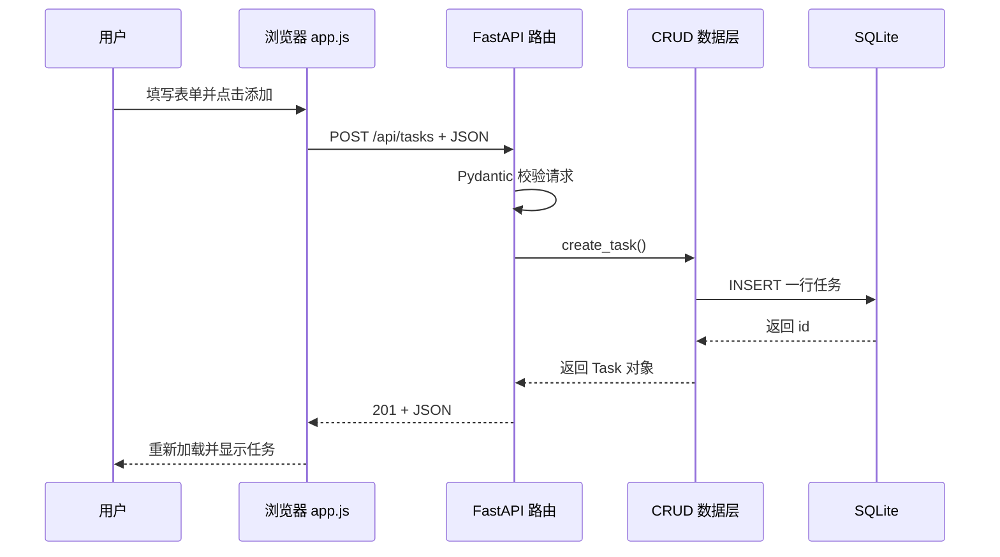

# FastAPI 学习项目：任务清单

这是一个适合从 0 开始学习 FastAPI 的全栈小项目。它包含：

- FastAPI：定义 HTTP 接口、参数校验、自动生成接口文档
- SQLAlchemy：用 Python 类操作 SQLite 数据库
- SQLite：把任务保存到项目根目录的 `tasks.db`
- 原生 HTML/CSS/JavaScript：展示前端页面，并用 `fetch` 调用后端
- 完整 CRUD：创建、查询、更新、删除任务

## 1. 环境准备

建议使用 Python 3.10 或更高版本。在 PowerShell 中进入本目录：

```powershell
cd D:\chenhuichuang\py_project\fastapi_learning_app
```

创建虚拟环境并安装依赖：

```powershell
python -m venv .venv
.\.venv\Scripts\Activate.ps1
pip install -r requirements.txt
```

如果 PowerShell 禁止激活脚本，也可以直接使用虚拟环境里的 Python：

```powershell
.\.venv\Scripts\python.exe -m pip install -r requirements.txt
```

## 2. 启动项目

```powershell
uvicorn app.main:app --reload
```

浏览器打开：

- 页面：http://127.0.0.1:8000
- Swagger 接口文档：http://127.0.0.1:8000/docs
- ReDoc 接口文档：http://127.0.0.1:8000/redoc
- 健康检查：http://127.0.0.1:8000/health

`--reload` 表示修改 Python 代码后，开发服务器自动重启；生产环境不要依赖它。

## 3. 建议阅读顺序

1. `app/main.py`：应用从哪里启动、路由和静态文件如何注册
2. `app/routers/tasks.py`：一个请求如何进入 Python 函数
3. `app/schemas.py`：请求 JSON 如何被校验
4. `app/crud.py`：数据库增删改查具体怎么写
5. `app/models.py`：Python 类如何对应 SQLite 表
6. `static/app.js`：网页如何调用接口并更新画面

## 4. 一次“添加任务”的完整链路



## 5. 动手练习

1. 给任务增加 `priority` 字段，并在页面显示优先级。
2. 增加 `GET /api/tasks?completed=true`，只返回已完成任务。
3. 把 `PUT` 改成支持“只更新一个字段”的 `PATCH`。
4. 为接口增加分页参数 `skip` 和 `limit`。

每次练习都建议先改数据库模型，再改 schemas、CRUD、路由，最后改前端。

